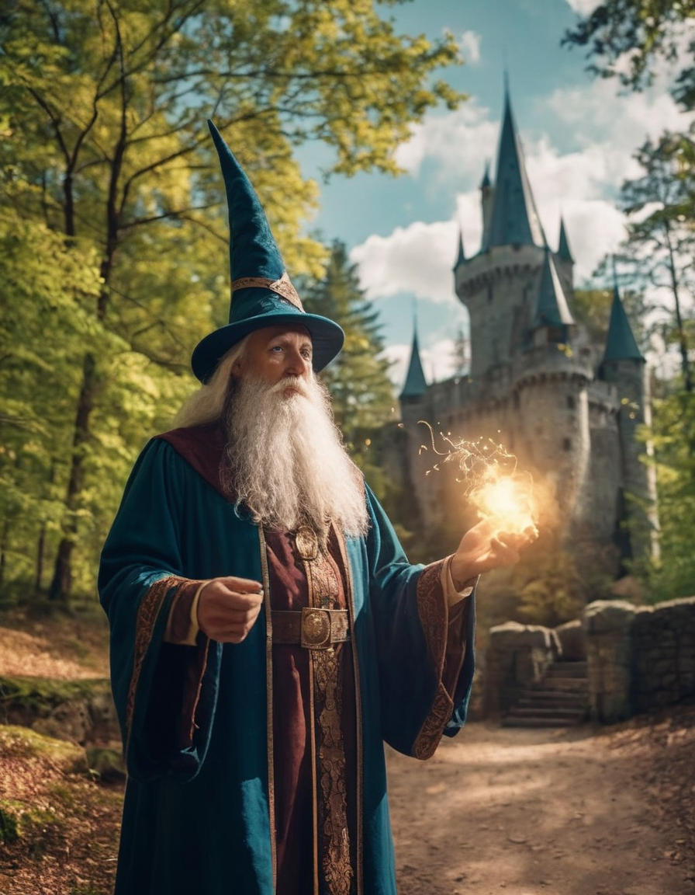

# What is Fooocus
Today we will look at Fooocus.
Fooocus is a image generating software. The creator calls Fooocus a rethinking of the popular and powerful Stable Diffusion and Midjourney.

Fooocus is free, open source and easy to use.

I learned about Fooocus after watching Fireship's [youtube video](https://www.youtube.com/watch?v=ky5ZB-mqZKM). I had heard about Midjourey and ofcourse DALL-E, but having such a powerful and easy too use tool for generating images completely free was to tempting to not try.

I started to catch up by reading about the different image generating AI software out there, and the more I read about Stable Diffusion and Midjourney the philosophy for Fooocus grew even more on me. I highly recommend reading the readme on [github](https://github.com/lllyasviel/Fooocus)

## Installation and use
The installation of the software was easy enough by following the instructions in the [readme](https://github.com/lllyasviel/Fooocus).
The Mac installation is at the time of writing not extensively tested, but for me, on my M2 Macbook Pro it works excellent, both the installation and the use of the Foocus tool encountered no issues.

It is worth mentioning that Fooocus is installed locally and use your machine hardware to generate the pictures, so having a decent dedicated GPU is needed.

Once you have installed Fooocus and are ready to use it you can just start typing in prompts to generate pictures.
If you want to use different presets you can choose the advanced option beneath the text box and choose what styles you want, and what presets in regards to speed and quality.

You can even use another image (or several) as a prompt of its own! It is really cool and you can easily use (too much) time playing around with different styles and prompts to see different results.
Read more about that functionality [here](https://github.com/lllyasviel/Fooocus/discussions/557)

## Results
Now let me show you some of the pictures that have been generating by me using different prompts:

Prompt:
***"A wizard outside a big castle performing magic in the forest"***

Prompt:
***"two big robots fighting eachother. Explosion in the background. On alien planet."***

Whit these basic prompts i think Fooocus did a good job of capturing what the prompt asked for.
I used all default settings for these results.
You can ofcourse use other presets to get results in i.e anime style if thats what you are after, or many other types of visual styles.

## Finishing thoughts
There are many comparison articles about how Foocus compares to other image generating software, and for what you get here it is hard to not recommend this tool for anyone interested in generating AI images.

Hopefully now you know a bit more about Fooocus and image generating software.
If you want a free, powerful and easy to use tool you should give Fooocus a try!

Happy prompting!

