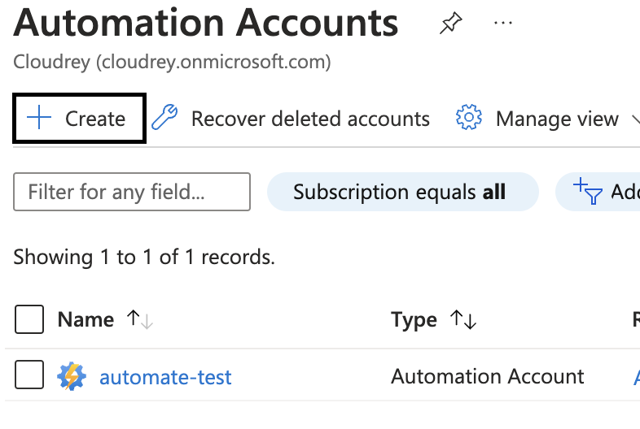
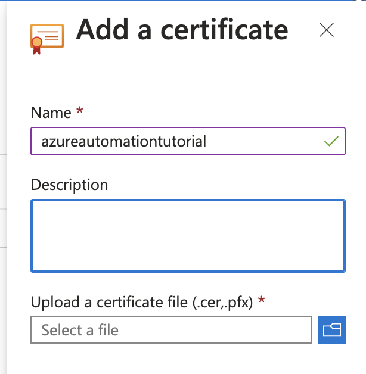
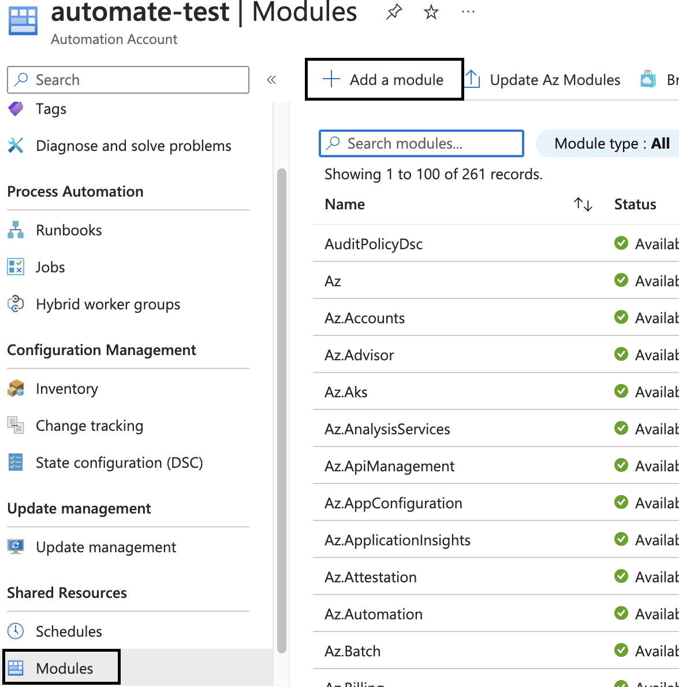
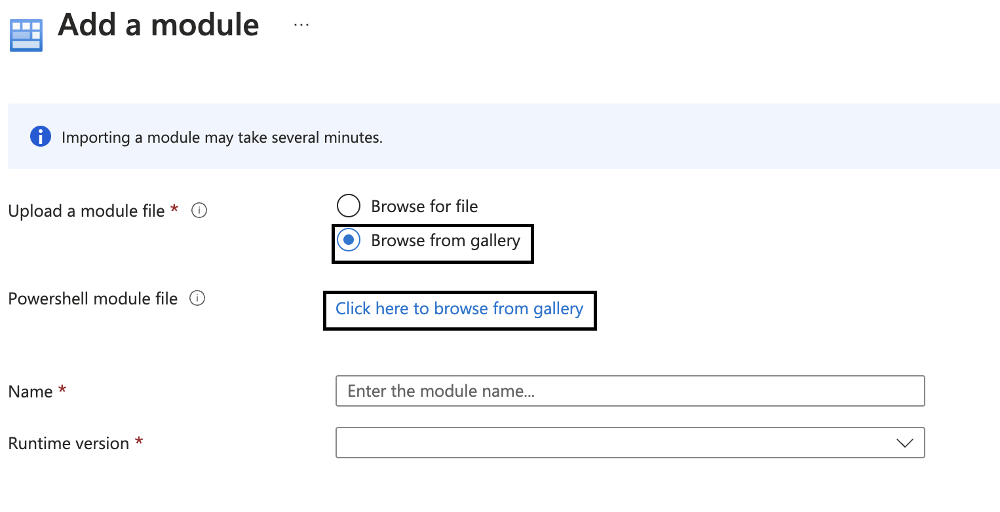
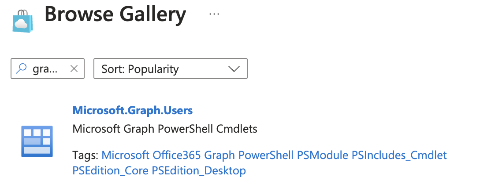
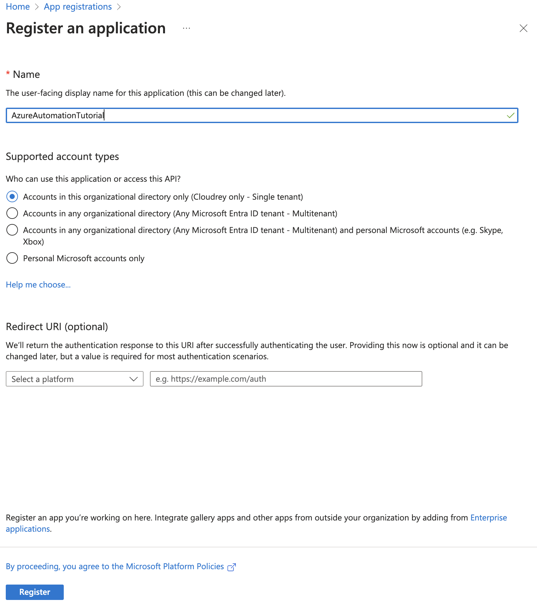
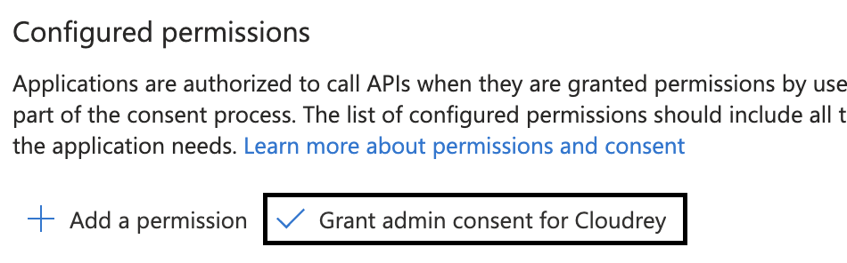
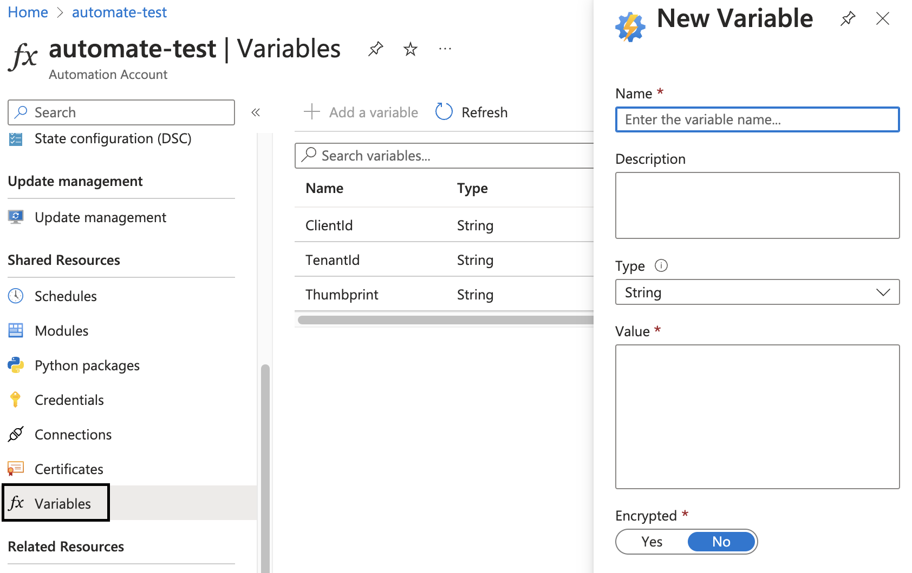
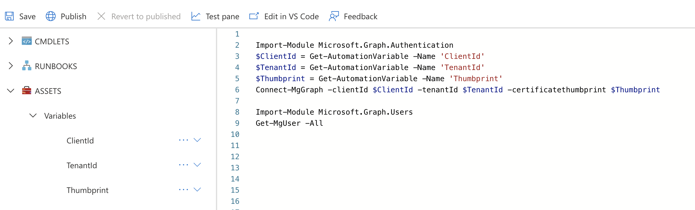
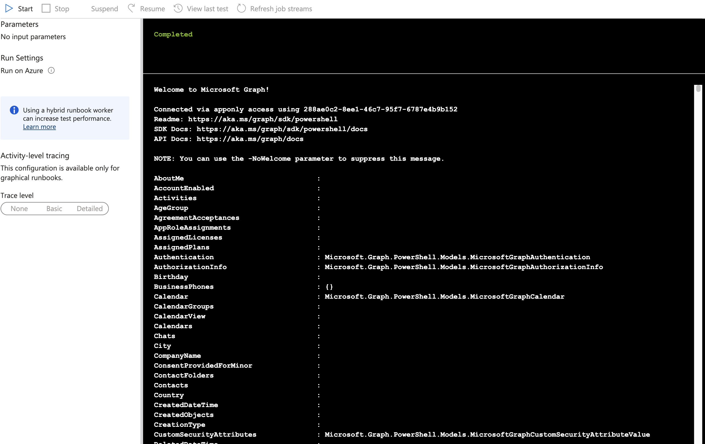

## Azure Automation overview

[Azure Automation](https://learn.microsoft.com/en-us/azure/automation/overview) is a service in Azure that allows you to run scripts and configure automation tasks that can run on a set schedule set up by you.
It is a fantastic tool to remove repetitive and boring tasks and a step forward in automating your organisations workflows.

You can use both PowerShell and Python giving you flexibility in how you want to develop the service.

In this tutorial we will create a automation account, an app registration for recognizing authentication and create a runbook with the code listing all users in our tenant.

For this example we will be using PowerShell and Microsoft Graph to retrieve our users. Graph is a powerful tool for accessing data in Microsoft 365 and have support for many different programming languages and requests.

## Create an automation account
In the Azure portal find "Automation Accounts" and click on "Create"

Give the automation account a descriptive name. Select the subscription and resource group the automation account shall live and finally create the resource.

Since we are creating a automated task we need a way for the automation account to authenticate to Entra ID without the need for personal credentials.
In order to do so we need to have a certificate. If you already have that you are golden. If not Microsoft have a good how-to you can use for testing that you can find [here](https://learn.microsoft.com/en-us/entra/identity-platform/howto-create-self-signed-certificate)
(PS: You need to do the optional step of exporting the public certificate with private key for this to work)

Once you have the certificate ready choose "Certificates" under the "Shared Resources" blade on the automation account.
Upload the .pfx file and enter the password you have chosen.

### Adding modules to the automation account
Now that we have created the automation account and have a certificate ready we can proceed with adding the modules from Graph we need in order for our script to work as we want.
Select the automation account you have created and beneath the "Shared Resources" blade click on "Modules"

Select "Add a module", on the new page choose "Browse from gallery" and then browse the Gallery.

For our task we need two modules.
We need ***Microsoft.Graph.Authentication*** for authenticating the app and we need ***Microsoft.Graph.Users*** to list the users.

Its a nice idea to install one module at a time and make sure it has been imported and is available before you import another.

## Create app registration
Next up we need to create an app registration in order for Entra ID to recognize the Automation runbook's certificate for authentication.
In the portal search for "App registration" and select it.
Select "New registration".

Then on the next page you can have the default selection and select "Register". If the application you have registered are to be used outside the tenant the app registration is created in you can explore the other options.

Once the app registration have been created take note of the "Application ID" and the "Directory ID" for use in the runbook later.
Now select "Certificates and Secrets and then "Upload certificate".
Here we upload the ".crt" file created earlier.

Once that is done on the app registration you have created select "API permissions" This is the authorized calls the runbook can make when its running.
Select "Add a permission" and click on "Microsoft Graph" and then "Application permissions" as we need the runbook to run without the use of user credentials.
Scroll down until you find "User". Expand the selection and check the "User.Read.All" which enables us to read the user profiles.
It is a good practice to never give more permissions to the app than what is needed to get the job done.

Select "Add permissions".
Back in the "API permissions" pane you now need to "Grant admin consent" for the app registration to have the permissions you now have granted enabled.

Now we are ready to create our runbook.

## Create a runbook
Back in our automation account you can create a runbook under the "Process Automation" blade.
Select the runbook and then click on "Create a runbook"
Select PowerShell and the runtime version you need. In this case I have selected 7.2, keep in mind the modules you use needs to aligned with the runtime version.

Once the runbook have been created I recommend getting familiar with the variables functionality that the azure automation account have.
Here you can enter the variables you need to authenticate. In our case the client ID, tenantID and the certificate thumbprint which is all used for authenticating the app.

Now select the created runbook and click "Edit" and then in the dropdown select "Edit in Portal". You can also choose VSC if you prefer. While working on a new script VSC would probably be a better choice as you can leverage autocomplete, and extensions to make the development more efficient.

In the sidebar you can select "Assets" and "Variables" to insert the variables you created on the automation account and they will automatically be available in the script.

`Import-Module Microsoft.Graph.Authentication
$ClientId = Get-AutomationVariable -Name 'ClientId'
$TenantId = Get-AutomationVariable -Name 'TenantId'
$Thumbprint = Get-AutomationVariable -Name 'Thumbprint'
Connect-MgGraph -clientId $ClientId -tenantId $TenantId -certificatethumbprint $Thumbprint
Import-Module Microsoft.Graph.Users
Get-MgUser -All`

As you can see from the picture we have imported the authentication module from graph and use the variables in the "Connect-MgGraph" to authenticate.
Then we import the User module from Graph and run "Get-MgUser -All" which lists all users.

Now you can click on "Test Pane" and press "Play" to test the script.

After the script has completed running you should see a picture like this:

We see that we have authenticated with graph and retrieved all information available through Graph for every user in the tenant.

Now you can format the output to the information you need, or use Graph to look for other relevant information for you business needs. Keep in mind that other modules and API permissions might need to be added in order to make the script work as intented.
Some Graph API calls also requires premium Entra ID priveleges.

Now you can set up a schedule for the runbook to run when you want it to.

I hope you now have a better idea of how you can leverage Azure Automation to automate tasks.

Stay curious and happy learning.

