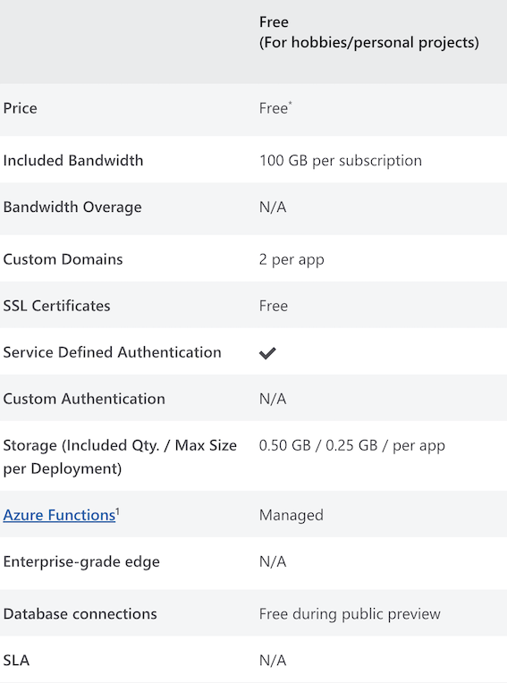

## Ever felt like you had something you wanted to share with the world?

In today's digital landscape, there are several providers that advertise free hosting. While it's true that you can host a site for free, you often encounter significant limitations and are pushed into using the host's ecosystem for website creation.

Many times, it feels more like a trial version, leading you to invest hours in building a website, only to discover that you need features like ***X or Z***, which are part of the paid plan.

Now, you're faced with a choice: pay up or feel like you've wasted hours setting up your website. Frustrating, isn't it?

But here's the good news. There's a growing number of offerings that provide free hosting, making it easier for people to have their own websites.

Today, I want to spotlight what Microsoft Azure has to offer. Specifically, they now have a free tier for hosting static web apps.

A static app, as opposed to a dynamic one, means that all the content is pre-rendered for all users with little to no server-side processing. This often results in faster and more reliable performance but comes with fewer options for handling requests and dynamic content.

Now that we have a clearer picture of what a static web app is, let's dive into Azure. When you use Azure, you get a free SSL certificate, 0.5GB of storage, and 10GB of bandwidth.

And by the way, Azure static web apps leverage GitHub Actions, making website updates a breeze. Simply commit changes to the main branch, push them to the repository, and voilà – your webpage is updated with the new changes.

_You can create your own free Azure account [***here***](https://azure.microsoft.com/en-us/free)_.

Now that hosting is sorted, it's time to build your website. Since we've chosen a static web app in Azure, you have several options.

Jekyll and Hugo are two of the most popular choices for creating static web apps.

You can't go wrong with either one. For my site, I went with Hugo, as I had previously tried Jekyll and wanted to explore something new.

I found both alternatives to be user-friendly. Jekyll is written in Ruby, while Hugo is written in Go. Both are open source and have vibrant communities.

Both offer a variety of templates to suit your needs, and you don't need to be a seasoned web developer or programmer to get your site up and running, although technical experience certainly helps.

Learn more about ***[Hugo](https://gohugo.io/)*** & ***[Jekyll](https://jekyllrb.com/)*** by clicking on their respective names.

Hope this information proves helpful. Stay curious!
