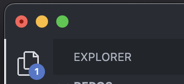
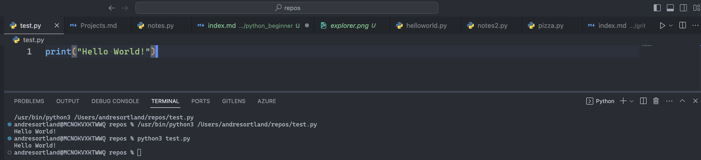

## Is it worth learning to code in 2023?

You've likely heard the doomsday prophecies about AI taking over our jobs, including those of programmers and codereaders. But if people don't understand programming and data science, how can they identify mistakes or explore alternative solutions?

Even if AI were to handle 98% of programming tasks perfectly tomorrow, we'd still need human competence to tackle that remaining 2%. Imagine the next generation, unfamiliar with coding but only skilled in prompting AI. When errors occur, we'd be in a tough spot.

Programming remains a vital skill in the IT world, and it will be for the foreseeable future. There's never a bad time to start learning. If you're a beginner looking to dive in, this blog article is the perfect starting point.

Today we'll look at Python, specifically Python3, which is the current supported version. Python is a high-level language used in various fields, from web development and data science to cloud computing and more. It's a powerful and versatile language with a rich library ecosystem that enhances development efficiency.

Python is an excellent first language to learn because of its readable syntax, and the concepts you grasp will benefit you in all future language exploration. Becoming proficient in programming isn't easy. I, for one, am far from a senior developer, but I've been coding in various languages and stacks for a few years and have come to appreciate the constant learning curve and challenges it brings.

Fundamentally, *programming is about problem-solving*. In order to reach that stage, you must first understand the structure and rules of the language you're using in order to manipulate your code to produce the desired output, translating your ideas into the correct sequence of 1's and 0's - It's a great feeling looking your produced code manifest itself on a screen.

Enough talk, let's get started.

## Let's Get Started

### Installing Python

To begin, you need Python installed on your system. You can choose from various installation methods:
- I recommend using a package manager like **Winget** (for Windows) or **Brew** (for MacOS) to simplify the installation process.
- Alternatively, you can download Python directly from the official website [here](https://www.python.org/downloads/) or from the Windows app store.

### Getting a Code Editor

While you can write Python code in a simple text editor, I highly recommend using a code editor like **Visual Studio Code** (VSCode). It's free, versatile, customizable, and supports multiple programming languages. You can install VSCode via a package manager or directly from [the official website](https://code.visualstudio.com/).

## Creating Your First Program

### Opening Visual Studio Code

1. Launch VSCode.
2. Choose "File" and open a directory or folder to store your code files.

### Creating a New Python File

- Inside VSCode, navigate to the left sidebar.

- Right-click and select "New File" or use the top ribbon to create a new file.
- Name the file as you like, but make sure it ends with ".py" to indicate it's a Python file.

### Writing Your First Python Code

Now, it's time to write your Python code.
- Inside your empty file, write the following code: `print("Hello World!")`.
- The `print` statement is used to display text in Python. Here, we want to output "Hello World!"

### Understanding Strings

We enclose the text "Hello World!" within double (`"`) or single (`'`) quotes to create a **string**. In Python, a string represents text data.

### Running Your Program

You can run your Python program in two ways:
- Click the "Run Code" button in the top-right corner of VSCode to see the output in the terminal window.
- Alternatively, open your terminal and navigate to the directory where your Python file is located. Then, execute the program using the command: `python3 nameoffile.py`.

### Seeing the Output

After running the program, you'll see the output in the terminal, which should display "Hello World!" Congratulations, you've officially written your first line of Python code!

## What's Next

Now that you've successfully created your first Python program, you're on your way to becoming a Python programmer. Stay tuned for more tutorials and concepts related to Python.

If you're eager to learn more, I highly recommend checking out [Python for Everyone](https://www.py4e.com/) by the esteemed Charles Severance. This resource will take you from an absolute beginner to exploring the fundamentals and real-world applications of Python. Enjoy your coding journey!

